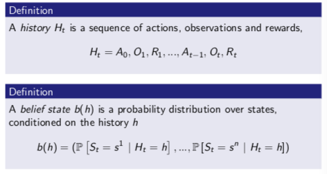
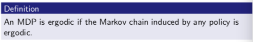
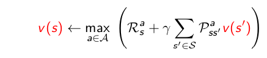

<!-- MarkdownTOC autolink="true" bracket="round" markdown_preview="markdown" -->

# Reinforcement learning

 
    Geonhee Lee
     
    gunhee6392@gmail.com

## Outline

- Introduction to Reinforcement learning
- Markov Decision Process(MDP)
- Dynamic Programming(DP)
- Monte Carlo Method(MC)
- Temporal Difference Method(TD)
  - SARSA
  - Q-Learning
- Planning and Learning with Tabular Methods
- On-policy Control with with Approximation
- On-policy Prediction with Approximation
- Policy Gradient Method
- Actor Critic Method

-----

# Introduction to Reinforcement learn

##  RL 특성

다른 ML paradigms과의 차이점
-   No supervisor, 오직 reward signal.
-   Feedback이 즉각적이지 않고 delay 된다.
-   Time이 큰 문제가 된다(연속적인, Independent and Identically Distributed(i.i.d, 독립항등분포) data가 아니다).
-   Agent의 행동이 agent가 수용하는 연속적인 data에 영향을 준다.

-----

### Reward

-   **Reward**: scalar feedback signal.
-   agent가 step t에서 얼마나 잘 수행하는 지 나타냄.
-   agent의 목표는 전체 reward의 합을 최대화하는 것
  
 

-----

### Sequential Decision Making

-   Goal: Total future reward를 최대화하는 action 선택.
-   Action들은 long term 결과들을 가질 것.
-   Reward는 지연될 것.
-   long-term reward를 더 크게 얻기 위해 즉각적인 reward를 희생하는 것이 나을 수도 있음.

 

-----

### History and State

-   history: observations, actions, rewards의 연속.
-   State: 다음에 어떤 일이 일어날 것인지 결정하기 위해 사용된 정보(다음 수식을 위한 정의로 보임)
-   공식으로는, state는 history의 함수이다.

$\qquad$$\qquad$$\qquad$$\qquad$ $\qquad$ $\qquad$     $S_t = f(H_t)$

-----

### Information State
-   Information state(a.k.a. Markov state)는 history로부터 모든 유용한 정보를 포함한다.
-   정보이론 관점에서의 information state 혹은 Markov state라는 상태가 있다. 데어터 관점에서 history의 유용한 정보들을 포함하고 있는 state를 의미한다.

> Definition
> > state $S_t$는 Markov 이다 if and only if
> > $P[S_{t+1} | S_t] = P[S_{t+1} | S_{1} , ... , S_t]$

-   미래는 현재의 과거와 독립적이다.
-   State가 주어지면, history는 버려질 수 있다.

-----

### Fully Observable Environments

-   **Full observability**: agent는 직접적으로 enviroment state를 관찰한다.

$\qquad$$\qquad$$\qquad$$\qquad$ $\qquad$ $\qquad$$\qquad$ $\qquad$     $O_t = S ^a _t = S ^e _t$

 

-   Agent state = environment state = information state.
-   형식적으로, 이것은 Markov decision precess(MDP).

 

-----

### Partially Observable Environments

-   Partial observability: agent는 간접적으로 environment를 관찰.
    -   (ex)robot이 카메라를 가지고 절대적인 위치를 알지못하는 것.
    -   (ex)포커를 하는 agent는 오직 오픈한 card들만 볼 수 있는 것.
-  여기서는, agent state $\neq$ environment state.
-  형식적으로, 이것을 partially observable Markob decision process(POMDP).
-  Agent는 자체 state representation $S ^a _t$을 구성해야만 한다.
   -  다음과 같은 방법으로 만들 수 있다(1. 전체 history 사용, 2. 확률을 사용, 3. RNN 방식 사용).
      -  Complete history: $S ^a _t = H _t$.
      -  **Beliefs** of environment state: $S ^a _t$ = $\mathbb{P}$ $[S ^e _t = s ^1] , ... , \mathbb{P}[S ^e _t = s ^n])$.
      -  Recurrent neural network: $S ^a _t = \sigma (S ^a _{t-1} W_s + O_t W_o )$.

 

-----

### RL Agent의 주요 성분

-   **Policy**: agent의 행동 함수.
-   **Value function**: 각 state 및/혹은 action이 얼마나 좋은지.
-   **Model**: agent's representation of the environment.

#### Policy

-   **Policy**: Agent의 행동.
-   State에서 action으로 매핑.
    -   Deterministic policy: a = $\pi (s)$.
    -   Stochastic policy: $\pi (a|s)$ = $\mathbb{P} [A_t = a | S_t = s]$.

 
    

#### Value function

-   **Value function**n: Future reward 예측 값.
-   State의 좋은것/나쁜것인지 판단하기 위해 사용.
-   Value function을 이용하여 action 선택

$\qquad$$\qquad$$\qquad$$\qquad$ $\qquad$ $\qquad$$\qquad$   $V_{\pi} = \mathbb{E} [R_{t+1} + \gamma R_{t+2} + \gamma ^2 R_{t+3} + ... | S_t = s]$

 
    

 

#### Model

-   **Model**: environment에서 다음에 행해질게 무엇인지 예측.
-   $P$: 다음 state를 예측.
-   $R$: 다음(즉각적인) reward를 예측.

$\qquad$$\qquad$$\qquad$$\qquad$ $\qquad$ $\qquad$$\qquad$   $P^a_{ss'}$ = $\mathbb{P}$ $[S_{t+1} = s' | S_t = s, A_t = a]$

$\qquad$$\qquad$$\qquad$$\qquad$ $\qquad$ $\qquad$$\qquad$     $R^a_{s}$ = $\mathbb{E}$ $[R_{t+1} | S_t = s, A_t = a]$

 
    

-   Agent는 env의 내부 모델을 가지고 있다고 가정.
    -   Dynamics: action들이 state를 변화시키는 방법.
    -   Rewards: 각 state으로부터 얼마의 reward를 받는 지.
    -   Model은 불완전할 것.

-   Grid layout은 transition model ($P_{ss'} ^a$)를 나타낸다.
-   숫자들은 (모든 행동에 동일한) 각 state s로부터 즉각적인 reward ($R ^a _s$)를 나타낸다.   

-----

### RL Agent 분류

 
    

#### Learnign and Planning

Sequential decision making에서 두 가지 근본적인 문제
- Reinforcement Learning:
  - Env는 초기에 알려져있지 않음.
  - Agent는 Env와 상호작용.
  - Agent는 policy를 향상시킴.

-   Planning:
    -   Env 모델은 알려져 있음.
    -   Agent는 (어떠한 외부 상호작용 없이) 모델과 계산을 수행.
    -   Agent는 policy를 향상시킴.
    -   a.k.a. deliberation, reasoning, introspection, pondering, thought, search.

----

#### Exploration and Exploitation

-   RL은 trial-and-error learning과 유사.
-   Agent는 good policy를 발견해야만 한다.
    -   Env의 경험으로부터 
    -   도중에 많은 reward를 잃지 않도록

-   **Exploration**은 Env에 대한 더 많은 정보를 찾는다.
-   **Exploitation**은 reward를 최대화하기 위해 알려진 정보를 exploit.
-   Exploit만큼 explore도 일반적으로 중요하다.

----

#### Prediction and Control

-   **Prediction**: future를 평가.
    -   주어진 policy를 이용하여 계산 및 평가.
        -   (아래그림)Uniform random policy의 value function은 무엇인가?

 
    

-   **Control**: future를 최적화.
    -   best policy를 찾는 것.
        -   (아래그림)모든 가능한 정책들에서 optimal value function은 무엇인가?
        -   (아래그림)Optimal policy는 무엇인가?

 
    

-----

# Markov Decision Process(MDP)

## Outline

-   Markov Processes
-   Markob Reward Processes
-   Markov Decision Processes
-   Extensions to MDPs
 

## Introduction to MDPs

-   Markov decision processes(MDP)는 RL에서 Env를 형식적으로 기술.
    -   여기서 Env는 fully observable.
    -   i.e., 현재 state는 완전하게 process의 특성을 나타냄.

-  대부분 모든 RL 문제들은 MDPs 로 공식화될 수 있다.
   -  Optimal control은 주로 continous MDPs를 다룬다.
   -  Partially Observable problem은 MDPs로 변환을 할 수 있다.
   -  Bandits은 하나의 state를 가진 MDPs이다.

 
 

----

## Markov Property

"미래는 현재에서의 과거와 독립적이다."

> Definition
> > state $S_t$는 _Markov_ if and only if
> >
> > $\qquad$$\qquad$$\mathbb{P} [S_{t+1} | S_t]$ = $\mathbb{P} [S_{t+1} | S_1, ..., S_t]$

-   State는 history로부터 모든 관련정보를 수집한다.
-   State가 알려졌다면, history는 버릴 수 있다.
    -   i.e. State는 미래의 sufficient statistic.   

 
 
 

----

## State Transition Matrix

Markov state $s$ 및 successor state $s'$에 대하여, __state transition probability__ 는 다음과 같이 정의된다.

$\qquad$$\qquad$$\qquad$$\qquad$$\qquad$$\qquad$    $P_{ss'} = \mathbb{P} [S_{t+1} = s' | S_t = s]$

__State transition matrix__ $P$는 모든 state $s$에서 모든 successor $s'$로의 transition probabilities를 다음과 같이 정의한다.

$\qquad$$\qquad$$\qquad$$\qquad$$\qquad$$\qquad$  to
$\qquad$$\qquad$$\quad$$P$ = from$
\begin{bmatrix} 
 P_{11}& ... & P_{1n}\\ 
\vdots & \ddots & \vdots \\
 P_{n1} & ... & P_{nn}
\end{bmatrix}
$

여기서 각 행렬의 행의 합은 1이다.

 
 

----

## Markov Process

__Markov process__ 는 memoryless random process, i.e. Markov property를 가진 random states $S_1 , S_2 , ...$ 의 sequence.

 
    

 

## Markov Reward Process

__Markov reward process__ 는 value를 가진 Markov chain(Markov Process)

 
    

 
 

### Return

 
    

-   Discount $\gamma \in [0, 1]$은 미래 보상들의 현재 값.
-   k+1 time-step 이후에 받게되는 reward의 값은 $\gamma ^k R$.
-   지연되는 reward는 즉각적인 reward를 중요시한다.
    -   $\gamma$가 0에 가까우면, "myopic(근시안적)" 평가를 도출.
    -   $\gamma$가 1에 가까우면, "far-sighted(미래를 내다보는)" 평가를 도출.

 
 

### Discount

대부분 __Markov reward__ 및 __decision process__ 는 discount된다. 왜?

-   수학적으로 discount reward에 대해 편리하다.
-   Cyclic Markov process에서 infinite return을 피한다.
-   미래에 대한 uncertainty는 fully representation 하지 않아도 된다.
-   동물/인간의 행동은 즉각적인 보상에 대해 선호하는 것을 볼 수 있다.

 
 
 

### Value Function

__Value function__ $v(s)$는 state $s$의 long-term 값을 제공한다.

 
    

 
 

### Bellman Equation for MRPs

Value function은 두 개의 part로 분리할 수 있다.
-   즉각적인 reward $R_{t+1}$
-   Successor state $\gamma v_{(S_{t+1})}$의 discounted value.

 
    
    

 
 

### Solving the Bellman Equation

-   Bellma Equation은 linear equation.
-   이 식은 다음과 같이 직접 풀 수 있다:

 
    

-    Computational complexity는 $n$ state에 대해 O($n^3$).
-    __Small MRPs__ 에 대해서만 직접 풀 수 있다.
-    __Large MRPs__ 에 대해 여러 iterative method가 있다.
     -    Dynamic programming(DP)
     -    Monte-Carlo evaluation(MC)
     -    Temporal-Difference learning(TD)

 
 

----

## Markov Decision Process

__Markov decision process(MDP)__ 는 __decision__ 을 가진 Markob reward process이다. 
모든 state들이 Markov인 Environment이다.

 
    

### Policies

 
    

-   **Policy** 는 agent의 behavior를 완벽히 정의.
-   MDP policy는 현재 state에만 의존(not the history).
    -   i.e. Policy는 stationary(time-independent). $A_t \sim  \pi (\cdot | S_t), \forall t > 0$
-   MDP $M = <S, A, P, R, \gamma>$ 및 policy $\pi$ 주어지고
    -   State sequence ($S_1, S_2, ...$)는 Markov process $<S, P^{\pi}>$
    -   State 및 reward sequence ($S_1, R_2, S_2, ...$)는 Markov reward process $<S, P^{\pi} R^{\pi}, \gamma>$
    -   여기서, 

$\qquad$$\qquad$$\qquad$$\qquad$$\qquad$$\qquad$  $P_{s,s'} ^{\pi} = \sum_{a \in A} \pi (a|s) P ^a _{ss'}$

$\qquad$$\qquad$$\qquad$$\qquad$$\qquad$$\qquad$  $R_{s} ^{\pi} = \sum_{a \in A} \pi (a|s) R ^a _{s}$

 
 

### Value Function

 
    

### Bellman Expectation Equation

**State-value($V$) function**은 즉각적인 reward와 successor state의 discounted value의 합으로 다시 분해할 수 있다.

$\qquad$$\qquad$$\qquad$$\qquad$ $v _{\pi} (s) = \mathbb{E} _{\pi} [R _{t+1} + \gamma v _{\pi} (S _{t+1} )| S _t = s]$

**Action-value($Q$) function** 은 유사하게 분해할 수 있다.

$\qquad$$\qquad$$\qquad$ $q _{\pi} (s, a) = \mathbb{E} _{\pi} [R _{t+1} + \gamma q _{\pi} (S _{t+1} , A _{t+1} )| S _t = s, A _t = a]$

 
 

#### Bellman Expectation Equation for $V ^{\pi}$

 
      
    

 
 

#### Bellman Expectation Equation for $Q ^{\pi}$

 
    
    

#### Optimal Value Function

 
    

-   Optimal value function은 MDP에서 best possible performance를 명시한다.
-   MDP는 optimal value fucntion을 안다면 풀 수 있다.

 
 

#### Optimal Policy

Policy의 부분 순서를 정의

$\qquad$$\qquad$$\qquad$$\qquad$$\qquad$$\qquad$  $\pi \geq \pi '$ if $v_{\pi} (s) \geq v_{\pi '} (s), \forall s$

 
    

 
 

#### Finding an Optimal policy

Optimal policy는 $q_* (s, a)$를 최대화하여 찾을 수 있다.

 
    

-   어떤 MDP에 대해서도 항상 deterministic optimal policy.
-   만약 $q_* (s, a)$를 알고 있다면, 즉시 optimal policy를 가질 수 있다.

 
 
 

### Bellman Optimality Equation

#### Bellman Optimality Equation for $V ^*$

Optimal value function은 재귀적으로 bellman optimality equation과 관련 있다.

 
    
    

#### Bellman Optimality Equation for $Q ^*$

 
    
    

#### Solving the Bellman Optimality Equation

-    Bellman Optimality Equation은 non-linear.
-    (일반적으로) closed form solution은 없다.
-    많은 iterative solution 방법:
     -    Value Iteration.
     -    Policy Iteration.
     -    Q-learning.
     -    Sarse.

 
 
 

-----

### Extensions to MDPs

-   Infinite and continous MSPs
-   Parially observable MDPs
-   Undiscounted, average reward MDPs

#### Infinite MDPs

다음 extension은 모두 이용가능하다:

-   Countably infinite state and/or action spaces
    -   Straightforward(명확, 간단한)
-   Continuous state and/or action spaces
    -   Closed form for linear quadratic model(LQR)
-   Continous time
    -   Requires partial differential equations
    -   Hamilton-Jacobi-Bellman (HJB) equation
    -   Limiting case of Bellman equation as time-step $\rightarrow$ 0

### Partially Observable Markov Decision Process(POMDPs)

POMDPs: Hidden state들을 가진 MDP. action을 가진 hidden Markov model.

 
    

#### Belief States

-   History: action, observation, reward의 sequence.
-   Belief state: history 조건에서의 state의 확률 분포.

 
    

#### Reductions of POMDPs

-   History $H_t$는 Markov property 만족.
-   Belief state $b ( H_t )$는 Markov property 만족.

 
    

-   POMDP는 (infinite) history tree로 축소될 수 있음.
-   POMDP는 (infinite) belief state로 축소될 수 있음.

 
 
 

-----

###  Ergodic Markov Process

-   Ergodic Markov process는
    -   Recurrent: 각 state는 무한히 방문됨
    -   Aperiodic: 각 state는 systematic 주기없이 방문됨.

-   Ergodic Markov process는 제한된 고정 분포 $d^{\pi} (s)$를 가짐.
-   정의:
    -   어떠한 policy에 의해 유도된 Markov chain이 ergodic이라면 MDP는 ergodic.
-   어떠한 policy $\pi$ 에 대해서, ergodic MDP는 start state의 독립적인 time-step ${\rho} ^{\pi}$ 분의(per) average reward를 가짐. 

 
    
     
    
     
     
     
    

 
 
 

----

###  Average Reward Value Function

-   Undiscounted의 value function, ergodic MDP는 average reward의 관점으로 표현될 수 있다.
-   $\tilde{v} _{\pi} (s)$는 state $s$ 에서 시작하기 때문에 extra reward.

 
    

이것은 average reward Bellman equation과 상응한다.

 
    

 
 
 

-----

# Planning by Dynamic Programming(DP)

1.  Introduction
2.  Policy Evaluation
3.  Policy Iteration
4.  Value Iteration
5.  Extensions to Dynamic Programming 
6.  Contraction Mapping

## Introduction

### What is Dynamic Programming

*Dynamic* : 문제에 대한 sequential 또는 temporal component,

*Programming* : "Program"을 최적화하는 것, i.e., policy
-   c.f.(참조) linear programming

__Dynamic programming__ :
-   복잡한 문제들을 푸는 방법.
-   문제들은 subproblem으로 분해하고,
    -   subproblem을 풀고,
    -   subproblem의 해를 결합.

 
 
 

----

### Requirements for Dynamic Programming

DP는 두 가지 특성을 가지는 문제들에 대한 가장 일반적인 솔루션.

1.  Optimal substructure
    -   Optimality 원리를 적용함.
    -   Optimal solution은 subproblem으로 분해될 수 있음.
2.  Overlapping subproblems
    -   Subproblem들은 여러번 반복됨.
    -   Solution은 저장 및 재사용 될 수 있음.
-   Markov decision process(MDP)는 두 가지 특성을 모두 만족:
    -   Bellman equation은 recursive decomposition을 제공.
    -   Value function은 solution을 저장 및 재사용.

### Planning by Dynamic Programming

-   Dynamic Programming은 MDP의 **full knowledge** 를 가정.
-   MDP에서 _planning_ 을 위해 사용 됨.
    -   For *prediction*:
        -   **Input**: 
            -   MDP $<S, A, P, R, \gamma >$ 및 Policy $\pi$
            -   or: $<S, P ^{\pi} , R ^{\pi} , \gamma >$
        -   **Output**: 
            -   value function $v _{\pi}$.
    -   Or for *control*:
        -   **Input**: 
            -   MDP $<S, A, P, R, \gamma >$.
        -   **Output**: 
            -   Optimal value function $v _{\pi}$  및 optimal policy $\pi _*$.

### Other Applications of Dynamic Programming

Dynamic Programming은 많은 다른 문제들로 풀기위해 사용되어 진다, 예:
-   Scheduling algorithms
-   String algorithms (e.g. sequence alignment)
-   Graph algorithms (e.g. shortest path algorithms)
-   Graphical models (e.g. Viterbi algorithm) 
-   Bioinformatics (e.g. lattice models)

-----

## Policy Evaluation

### Iterative Policy Evaluation

-   Problem: 주어진 policy $\pi$ 를 evaluation
-   Solution: iterative application of Bellman expectation backup
    -   $v_1 \rightarrow v_2 \rightarrow ... \rightarrow v _{\pi}$
    -   *synchronous* backup을 사용
        -   At each iteration k + 1,
        -   For all states s $\in S$ ,
        -   $v _k (s')$ 으로부터 $v _{k+1} (s)$ update.
            -   여기서 $s'$ 는 $s$ 의 successor state.

-   나중에는 *asynchronous* backup을 사용할 것.
-   $v _{\pi}$ 로의 수렴은 현재 part 마지막에서 증명할 것.

 
    

### Example: Small Grid world

#### Evaluating a Random Policy in the Small Gridworld

 
    

-   Undiscounted episodic MDP ( $\gamma$  = 1).
-   Terminal state(gray)로 도달할 때까지 reward는 -1.
-   Agent는 uniform random policy를 따른다.
    -   $\pi (n | \cdot )$ = $\pi (e | \cdot )$ = $\pi (s | \cdot )$ = $\pi (w | \cdot )$ = 0.25 (= 동서남북 방향으로 동일한 확률로 이동).

 
    
    

-----

## Policy Iteration

### How to Improve a Policy

-   Policy $\pi$가 주어지면,
    -   **Evaluate** the policy $\pi$
        -   $v _{\pi} (s)$ = $\mathbb{E} [R _{t+1} + \gamma R _{t+2} + ... | S _t = s]$
    -   $v _ \pi$ 에 대하여 탐욕적(greedily)으로 행동하여 policy를 **Improve**  
        -   $\pi '$ = greedy ( $v _{\pi}$ )

-   Small Gridworld에서 **improved policy**는 optimal, $\pi ' = \pi ^*$.
-   일반적으로, 더 많은 improvement / evaluation의 interation들이 필요.
-   But, **policy iteration** 의 process는 항상 $\pi ^*$ 로 수렴.

 
    

### Policy Improvement

-   Deterministic policy a = $\pi (s)$를 고려하자.
-   탐욕적(greddily)으로 행동하여 policy를 *improve* 할 수 있다
    -   $\pi ' (s)$ = argmax $_{a \in A} q _{\pi} (s, a)$
-   One step에 걸쳐 state 어떠한 $s$ 로부터 value를 improve,
    -   $q _{\pi} (s, \pi ' (s))$ = max $_{a \in A} q _{\pi} (s, a) \geq q _{\pi} (s, \pi (s)) = v _{\pi} (s)$
-   위의 과정으로 value function을 improvement,
    -   $v _{\pi} (s) \leq q _{\pi} (s, \pi ' (s)) = \mathbb{E} _{\pi '} [R _{t+1} + \gamma v _{\pi} (S _{t+1}) | S _t = s]$
    -   $\qquad$  $\leq \mathbb{E} _{\pi '} [R _{t+1} + \gamma q _{\pi} (S _{t+1} , \pi ' (S _{t+1})) | S _t = s]$
    -   $\qquad$  $\leq \mathbb{E} _{\pi '} [R _{t+1} + \gamma R _{t+2}  + \gamma ^{2} q _{\pi} (S _{t+2} , \pi ' (S _{t+2})) | S _t = s]$
    -   $\qquad$  $\leq \mathbb{E} _{\pi '} [R _{t+1} + ... | S _t = s]$ = $v _{\pi '} (s)$

-    만약 improvement가 중단되면,
     -    $q _{\pi} (s, \pi ' (s)) = max _{a \in A} q _{\pi} (s, a) = q _{\pi} (s, \pi (s)) = v _{\pi} (s)$
-   그다음 Bellman optimality equation은 다음을 만족한다:
    -   $v _{\pi} (s) = max _{a \in A} q _{\pi} (s, a)$
-   그러므로 $v _{\pi} (s) = v _* (s)$ for all $s \in S$
-   그래서 $\pi$ 는 **optimal policy**.

 
 
 

-----

## Value Iteration

### Value Iteration in MDPs

#### Principle of Optimality

모든 optimal policy는 두 개의 성분으로 분할:
-   Optimal first action $A _*$
-   Followed by an optimal policy from successor state $S'$

 
    

 
 
 

#### Deterministic Value Iteration

-   만약 subproblem $v _* (s')$ 에대한 solution을 안다면,
    -   solution $v _* (s)$ 는 one-step lookahead에의해 찾을 수 있다
        -   $v _* (s) \leftarrow max _{a \in A} R ^a _s + \gamma \sum_{s' \in S} P ^a _{ss'} v _* (s')$
    -   Value iteration의 idea는 반복적으로 갱신하는 것을 적용.
    -   Intuition: 마지막 reward를 가지고 시작하여 backward 방향으로 진행

 
    

#### Value Iteration

-   Problem: optimal policy $\pi$ 를 찾는 것.
-   Solution: iterative application of Bellman optimality backup.
    -   $v_1 \rightarrow v_2 \rightarrow ... v_*$
    -   Syncgronous backup 사용
        -   At each iteration k+1
        -   For all state $s \in S$
        -   $v _k (s')$ 으로부터 $v _{k+1} (s) 갱신$
    -   $v _*$ 으로 수렴하는 것은 이후에 증명.
    -   Policy iteration과 달리, explicit policy가 없음(최대값 찾는 정책).
    -   Intermediate value function은 어떤 policy과도 일치하지 않을 수 있음.

 
    

 
 

### Summarry of DP Algorithms

#### Synchronous Dynamic Programming Algorithms

 
    

 
 
 

### Extensions to Dynamic Programming

#### Asynchronous Dynamic Programming 

-   DP 방법은 지금까지 *synchronous backup* 을 사용하여 기술.
    -   i.e. 모든 state들은 parallel(병렬적)하게 back up되었다.

-   *Asynchronous DP* 는 각각 순서상관없이 state들을 back up
    -   각각 선택된 state에 대해서, 적절한 back up을 적용하고,
    -   Computation을 상당히 줄일 수 있고,
    -   모든 state가 계속 선택되면, 수렴성을 보장.

-   Asynchronous dynamic programming에 대한 세 가지 간단한 ideas:
    -   _In-place dynamic programming_
    -   _Prioritised sweeping_
    -   _Real-time dynamic programming_

 

#### In-place Dynamic Programming 

-   Synchronous value iteration은 모든 $s \in S$에 대해서 value function의 두 개의 복사본들을 저장.

 
    

-   In-place value iteration은 모든 $s \in S$에 대해서 **오직 하나의 복사본**을 저장.

    

 

#### Prioritised sweeping

-   State 선택하기 위해서 Bellman error의 크기를 사용, e.g.

    

-   가장 큰  Bellman error가 있는 state를 back-up,
-   각 back-up 후에 영향을 받는 Bellman error 업데이트.
-   Reverse dynamic (predecessor state)의 지식을 요구한다.
-   Priority queue를 유지하여 효율적으로 구현될 수 있다.

 

#### Real-time dynamic programming

-   Idea: 오직 agent와 관련있는 state
-   State의 선택하기 위해 agent의 경험을 사용.
-   각 time-step $S _t , A _t , R _{t+1}$ 이후에,
-   State $S _t$ 를 back-up.

    

 

### Full-Width Backups

-   DP는 _full-width_ backup을 사용.
-   각 backup(sync or async)에 대하여,
    -   모든 successor state 및 action아 고려.
    -   MDP transition 및 reward function의 knowledge 사용.

-   DP는 medium-sized 문제에 대해 효율적(100만 state)
-   큰 문제에 대해서, DP는 Bellman은 차원의 저주( _curse of dimensionality_ )
    -   state의 수 ( $n = |S|$ )는 state 변수의 수의 기하급수적으로 증가.
-   심지어 하나의 backup도 매우 expensive될 수 있음.

    

 

### Sample Backups

-   다음 강의는 _sample backup_ 들에 대해 고려할 것.
    -   Reward function( $R$ )  및 transition dynamics( $P$ ) 대신에,
    -   Sample reward 및 sample trainsition $<S, A, R, S'>$ 사용

-   장점:
    -   Model-free: MDP의 사전 지식을 요구하지 않음.
    -   __Sampling__ 을 통해 차원의 저주를 타개.
        -   Backup 비용은 상수이고, $n = |S|$ 에 독립적.

    

 

### Approximate Dynamic Programming

-    Value function을 근사화
     -    _function approximator ( $\hat{v} (s, w)$ )_ 을 사용.
     -    DP를 $\hat{v} (s, w)$ 에 적용.

-   e.g. 각 iteration $k$ 에 맞는 value Iteration을 반복,
    -   Sample states $\tilde{S} \subseteq S$
    -   각 state $s \in \tilde{S}$ 에 대해서, Bellman optimality equation을 사용하여 target value를 추정, 
    -   Target { < $s, \tilde{v} _k (s)$ > } 을 사용하여, next value function $\hat{v} ( \cdot , w _{k+1} )$ 을 학습.

    

 

> 아래는 수렴성 증명 내용.

### Contraction Mapping

#### Some Technical Questions

-   Value iteration이 $v _*$에 수렴하는 것을 어떻게 알 수 있을까?
-   Or iterative policy evaluation이 $v _{\pi}$ 에 수렴하는가?
-   And therefore policy iteration이 $v _*$ 에 수렴하는가?
-   Solution이 유일(unique)한가?
-   얼마나 이러한 알고리즘들이 빠르게 수렴하는가?
-   이러한 질문들은 **contraction mapping theorem** 에 의해 해결됨.

#### Value Function Space

-   Value function들에 걸쳐 vector space $V$ 를 고려해보자
    -   $|S|$ 차원
    -   이러한 공간에서 각 지점은 value function $v(s)$ 를 명시.
    -   이러한 공간에서 Bellman backup은 어떤 지점에 대해서 수행되는가?
    -   Value function을 *closer* 로 가져다주는 것을 보여줄 것.
    -   따라서 backup은 unique solution에 수렴해야만 한다.

#### Value Function $\infty$ - Norm

-   $\infty$ - norm에 의한 State-value fucntion(u, v) 간의 거리를 측정할 것.
-   i.e. state value간의 가장 큰 차이

   

    

#### Bellman Expectation Backup is a Contraction

-   _Bellman expectation backup operator_ ($T ^{\pi}$) 정의.
  

    

-   이 operator는 $\gamma$ - contraction, i.e. 이것은 value function을 적어도 $\gamma$ 만큼 가까워지도록 만든다.

    

#### Contraction Mapping Theorem

-   Theorem(Contracting Mapping Theorem)
    -   어떤 metric space $V$ 에 대해서 operator $T(v)$하에서 complete (i.e. closed) 이라면,
    -   여기서 $T$ 가  $\gamma$ -contraction
        -   $T$ 는 unique fixed point에 수렴.
        -   $\gamma$ 의 비율로 선형적으로 수렴.

    

#### Convergence of Iter. Policy Evaluation and Policy Iteration

    

#### Bellman Optimality Backup is a Contraction

    

####  Convergence of Value Iteration

    

-----

# Monte Carlo Method(MC)

-----

# Temporal Difference Method(TD)

-----

# Planning and Learning with Tabular Methods

-----

# On-policy Control with with Approximation

-----

# Policy Gradient Method

-----

# Actor Critic Method

  

# Reference
[1] [UCL Course on RL](http://www.cs.ucl.ac.uk/staff/D.Silver/web/Teaching.html)

[2] [Reinforcement Learning: Tutorial(Seoul National University of Sceience and Technology)](https://www.evernote.com/shard/s675/nl/180905195/4db9d86b-791f-4b1b-ac81-e02fc0667025/)

[3] [Reinforcement Learning : An Introduction, Sutton](https://www.evernote.com/shard/s675/nl/180905195/675ca894-3bb5-4e9f-975e-6e12c313e7d4/)

[4] [jay.tech.blog](https://jay.tech.blog/2016/12/25/markov-decision-processes/)

[5] [대손의 스마트 웹](http://daeson.tistory.com/312?category=710652)