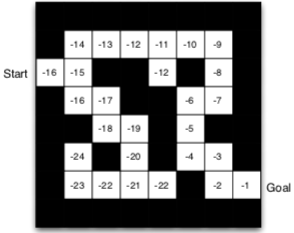
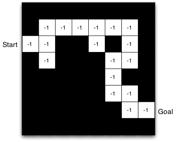

<!-- MarkdownTOC autolink="true" bracket="round" markdown_preview="markdown" -->

# Reinforcement learning

 
    Geonhee Lee
     
    gunhee6392@gmail.com

## Outline

- Introduction to Reinforcement learning
- Markov Decision Process(MDP)
- Dynamic Programming(DP)
- Monte Carlo Method(MC)
- Temporal Difference Method(TD)
  - SARSA
  - Q-Learning
- Planning and Learning with Tabular Methods
- On-policy Control with with Approximation
- On-policy Prediction with Approximation
- Policy Gradient Method
- Actor Critic Method

-----

# Introduction to Reinforcement learn

##  RL 특성

다른 ML paradigms과의 차이점
-   No supervisor, 오직 reward signal.
-   Feedback이 즉각적이지 않고 delay 된다.
-   Time이 큰 문제가 된다(연속적인, Independent and Identically Distributed(i.i.d, 독립항등분포) data가 아니다).
-   Agent의 행동이 agent가 수용하는 연속적인 data에 영향을 준다.

-----

### Reward

-   **Reward**: scalar feedback signal.
-   agent가 step t에서 얼마나 잘 수행하는 지 나타냄.
-   agent의 목표는 전체 reward의 합을 최대화하는 것
  
 

-----

### Sequential Decision Making

-   Goal: Total future reward를 최대화하는 action 선택.
-   Action들은 long term 결과들을 가질 것.
-   Reward는 지연될 것.
-   long-term reward를 더 크게 얻기 위해 즉각적인 reward를 희생하는 것이 나을 수도 있음.

 

-----

### History and State

-   history: observations, actions, rewards의 연속.
-   State: 다음에 어떤 일이 일어날 것인지 결정하기 위해 사용된 정보(다음 수식을 위한 정의로 보임)
-   공식으로는, state는 history의 함수이다.

$\qquad$$\qquad$$\qquad$$\qquad$ $\qquad$ $\qquad$     $S_t = f(H_t)$

-----

### Information State
-   Information state(a.k.a. Markov state)는 history로부터 모든 유용한 정보를 포함한다.
-   정보이론 관점에서의 information state 혹은 Markov state라는 상태가 있다. 데어터 관점에서 history의 유용한 정보들을 포함하고 있는 state를 의미한다.

> Definition
> > state $S_t$는 Markov 이다 if and only if
> > $P[S_{t+1} | S_t] = P[S_{t+1} | S_{1} , ... , S_t]$

-   미래는 현재의 과거와 독립적이다.
-   State가 주어지면, history는 버려질 수 있다.

-----

### Fully Observable Environments

-   **Full observability**: agent는 직접적으로 enviroment state를 관찰한다.

$\qquad$$\qquad$$\qquad$$\qquad$ $\qquad$ $\qquad$$\qquad$ $\qquad$     $O_t = S ^a _t = S ^e _t$

 

-   Agent state = environment state = information state.
-   형식적으로, 이것은 Markov decision precess(MDP).

 

-----

### Partially Observable Environments

-   Partial observability: agent는 간접적으로 environment를 관찰.
    -   (ex)robot이 카메라를 가지고 절대적인 위치를 알지못하는 것.
    -   (ex)포커를 하는 agent는 오직 오픈한 card들만 볼 수 있는 것.
-  여기서는, agent state $\neq$ environment state.
-  형식적으로, 이것을 partially observable Markob decision process(POMDP).
-  Agent는 자체 state representation $S ^a _t$을 구성해야만 한다.
   -  다음과 같은 방법으로 만들 수 있다(1. 전체 history 사용, 2. 확률을 사용, 3. RNN 방식 사용).
      -  Complete history: $S ^a _t = H _t$.
      -  **Beliefs** of environment state: $S ^a _t$ = $\mathbb{P}$ $[S ^e _t = s ^1] , ... , \mathbb{P}[S ^e _t = s ^n])$.
      -  Recurrent neural network: $S ^a _t = \sigma (S ^a _{t-1} W_s + O_t W_o )$.

 

-----

### RL Agent의 주요 성분

-   **Policy**: agent의 행동 함수.
-   **Value function**: 각 state 및/혹은 action이 얼마나 좋은지.
-   **Model**: agent's representation of the environment.

#### Policy

-   **Policy**: Agent의 행동.
-   State에서 action으로 매핑.
    -   Deterministic policy: a = $\pi (s)$.
    -   Stochastic policy: $\pi (a|s)$ = $\mathbb{P} [A_t = a | S_t = s]$.

 
    

#### Value function

-   **Value function**n: Future reward 예측 값.
-   State의 좋은것/나쁜것인지 판단하기 위해 사용.
-   Value function을 이용하여 action 선택

$\qquad$$\qquad$$\qquad$$\qquad$ $\qquad$ $\qquad$$\qquad$   $V_{\pi} = \mathbb{E} [R_{t+1} + \gamma R_{t+2} + \gamma ^2 R_{t+3} + ... | S_t = s]$

 
    

 

#### Model

-   **Model**: environment에서 다음에 행해질게 무엇인지 예측.
-   $P$: 다음 state를 예측.
-   $R$: 다음(즉각적인) reward를 예측.

$\qquad$$\qquad$$\qquad$$\qquad$ $\qquad$ $\qquad$$\qquad$   $P^a_{ss'}$ = $\mathbb{P}$ $[S_{t+1} = s' | S_t = s, A_t = a]$

$\qquad$$\qquad$$\qquad$$\qquad$ $\qquad$ $\qquad$$\qquad$     $R^a_{s}$ = $\mathbb{E}$ $[R_{t+1} | S_t = s, A_t = a]$

 
    

-   Agent는 env의 내부 모델을 가지고 있다고 가정.
    -   Dynamics: action들이 state를 변화시키는 방법.
    -   Rewards: 각 state으로부터 얼마의 reward를 받는 지.
    -   Model은 불완전할 것.

-   Grid layout은 transition model ($P_{ss'} ^a$)를 나타낸다.
-   숫자들은 (모든 행동에 동일한) 각 state s로부터 즉각적인 reward ($R ^a _s$)를 나타낸다.   

-----

### RL Agent 분류

 
    

#### Learnign and Planning

Sequential decision making에서 두 가지 근본적인 문제
- Reinforcement Learning:
  - Env는 초기에 알려져있지 않음.
  - Agent는 Env와 상호작용.
  - Agent는 policy를 향상시킴.

-   Planning:
    -   Env 모델은 알려져 있음.
    -   Agent는 (어떠한 외부 상호작용 없이) 모델과 계산을 수행.
    -   Agent는 policy를 향상시킴.
    -   a.k.a. deliberation, reasoning, introspection, pondering, thought, search.

----

#### Exploration and Exploitation

-   RL은 trial-and-error learning과 유사.
-   Agent는 good policy를 발견해야만 한다.
    -   Env의 경험으로부터 
    -   도중에 많은 reward를 잃지 않도록

-   **Exploration**은 Env에 대한 더 많은 정보를 찾는다.
-   **Exploitation**은 reward를 최대화하기 위해 알려진 정보를 exploit.
-   Exploit만큼 explore도 일반적으로 중요하다.

----

#### Prediction and Control

-   **Prediction**: future를 평가.
    -   주어진 policy를 이용하여 계산 및 평가.
        -   (아래그림)Uniform random policy의 value function은 무엇인가?

 
    

-   **Control**: future를 최적화.
    -   best policy를 찾는 것.
        -   (아래그림)모든 가능한 정책들에서 optimal value function은 무엇인가?
        -   (아래그림)Optimal policy는 무엇인가?

 
    

-----

# Markov Decision Process(MDP)

## Outline

-   Markov Processes
-   Markob Reward Processes
-   Markov Decision Processes
-   Extensions to MDPs
 

## Introduction to MDPs

-   Markov decision processes(MDP)는 RL에서 Env를 형식적으로 기술.
    -   여기서 Env는 fully observable.
    -   i.e., 현재 state는 완전하게 process의 특성을 나타냄.

-  대부분 모든 RL 문제들은 MDPs 로 공식화될 수 있다.
   -  Optimal control은 주로 continous MDPs를 다룬다.
   -  Partially Observable problem은 MDPs로 변환을 할 수 있다.
   -  Bandits은 하나의 state를 가진 MDPs이다.

 

----

## Markov Property

"미래는 현재에서의 과거와 독립적이다."

> Definition
> > state $S_t$는 _Markov_ if and only if
> > $\mathbb{P} [S_{t+1} | S_t]$ = $\mathbb{P} [S_{t+1} | S_1,]$

-----

# Dynamic Programming(DP)

-----

# Monte Carlo Method(MC)

-----

# Temporal Difference Method(TD)

-----

# Planning and Learning with Tabular Methods

-----

# On-policy Control with with Approximation

-----

# Policy Gradient Method

-----

# Actor Critic Method

  

# Reference
[1] [UCL Course on RL](http://www.cs.ucl.ac.uk/staff/D.Silver/web/Teaching.html)

[2] [Reinforcement Learning: Tutorial(Seoul National University of Sceience and Technology)](https://www.evernote.com/shard/s675/nl/180905195/4db9d86b-791f-4b1b-ac81-e02fc0667025/)

[3] [Reinforcement Learning : An Introduction, Sutton](https://www.evernote.com/shard/s675/nl/180905195/675ca894-3bb5-4e9f-975e-6e12c313e7d4/)

[4] [jay.tech.blog](https://jay.tech.blog/2016/12/25/markov-decision-processes/)

[5] [대손의 스마트 웹](http://daeson.tistory.com/312?category=710652)